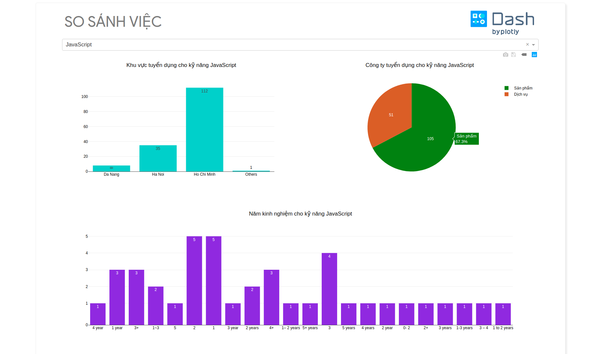

title: Ứng dụng web SO SÁNH VIỆC
slug: sosanhviec
category: Data analysis
Date: 2019-01-24

[Demo](https://sosanhviec.herokuapp.com/) là một ứng dụng web phân tích việc làm trong lĩnh vực CNTT.

# Mô tả vấn đề
- Từ nhu cầu của bản thân sinh viên để tìm việc, nhưng mỗi trang web việc làm có cách sử dụng hơi khác nhau, khiến mình rất mệt mỏi khi đi qua họ để tìm việc làm mới.

- Tìm việc là một công việc tốn thời gian, bạn sẽ cần rất nhiều thông tin để tham khảo. Bạn mất quá nhiều thời gian để tìm được công việc bạn muốn, bạn sẽ bỏ lỡ cơ hội việc làm phù hợp nhất với mình.

# Giải quyết vấn đề
- Trong dự án này sẽ sử dụng trình thu thập dữ liệu web để xây dựng một hệ thống dữ liệu đơn giản, sau đó phân tích dữ liệu được thu thập và xuất dưới dạng biểu đồ cho những người tìm kiếm việc làm mới và giải quyết thị trường việc làm trong lĩnh vực CNTT.

- Một ứng dụng web được phát triển bằng ngôn ngữ lập trình Python, cho phép người dùng tìm kiếm các từ khóa là kỹ năng và nhận các biểu đồ phân tích trực quan như phân bổ khu vực tuyển dụng, phạm vi lương, loại công ty, số năm kinh nghiệm, vị trí, bằng cấp, danh sách các công việc được đề xuất, ...

# Kiến trúc ứng dụng được sử dụng trong dự án
- Đối với dự án này, back-end sử dụng **Flask**. Flask là một khung web vi mô được viết bằng Python, front-end sử dụng **Dash**. Dash là lý tưởng để xây dựng các ứng dụng trực quan hóa dữ liệu với giao diện người dùng tùy chỉnh cao trong Python thuần túy.

- Hệ thống thu thập dữ liệu website sử dụng **Scrapy**. Scrapy là một khung thu thập dữ liệu web miễn phí và mã nguồn mở được viết bằng **Python**.

- Các dữ liệu thu thập được phân tích bởi các thư viện **pandas**, **numpy**, **matplotlib**.

# Kết quả nghiên cứu
- Nhiều thông tin việc làm mới mỗi ngày được tổng hợp từ  hai trang web công nghệ thông tin lớn **topdev.vn** và **itviec.com**.

- Nhiều gợi ý về kỹ năng, vị trí, trình độ, kinh nghiệm và mức lương sẽ giúp bạn dễ dàng nghiên cứu hơn trước khi tìm việc, tất cả công việc đã tập trung trên **So Sánh Việc** với cách sử dụng đơn giản và nhất quán.

# Định hướng phát triển
- Thay vì duyệt thủ công thông qua các bài đăng công việc. Nhóm phát triển muốn hồ sơ của ứng viên được kết hợp với các vị trí tốt nhất hiện có. Có nhiều trang web cung cấp dịch vụ tương tự? Chắc chắn, nhưng bạn phải đăng nhập vào nhiều trang web, chia sẻ thông tin cá nhân của bạn, kiểm tra danh tiếng của công ty ... điều đó khá phức tạp.

- Mặc dù có thể khó khăn và tốn thời gian để khớp một sơ yếu lý lịch với nhiều nguồn, có thể đảo ngược cách tiếp cận và tạo một cơ sở dữ liệu đăng công việc duy nhất kết hợp nhiều kết quả của nhiều truy vấn cho một vị trí cụ thể. Cơ sở dữ liệu sau đó được khớp với sơ yếu lý lịch và các khuyến nghị tốt nhất được cung cấp trên cơ sở một bộ kỹ năng nhất định.
