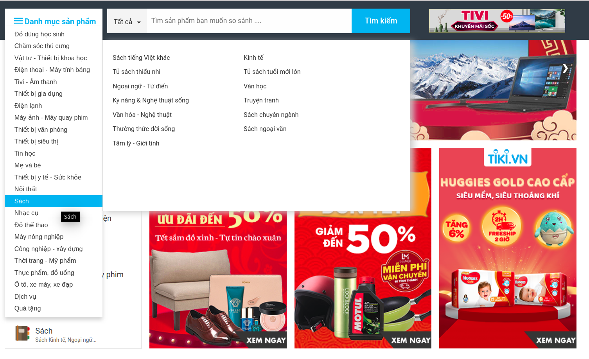
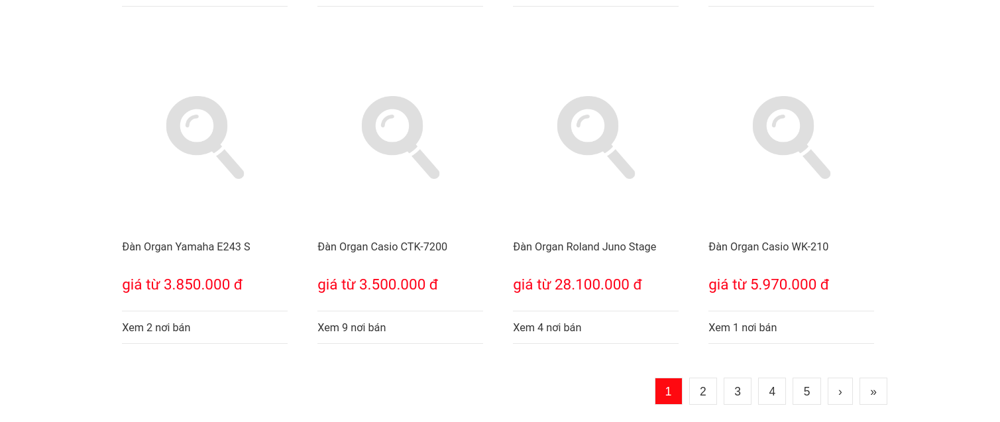
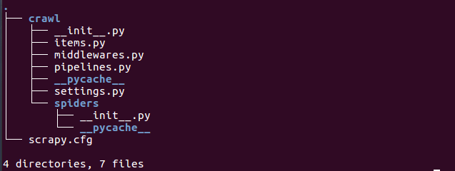
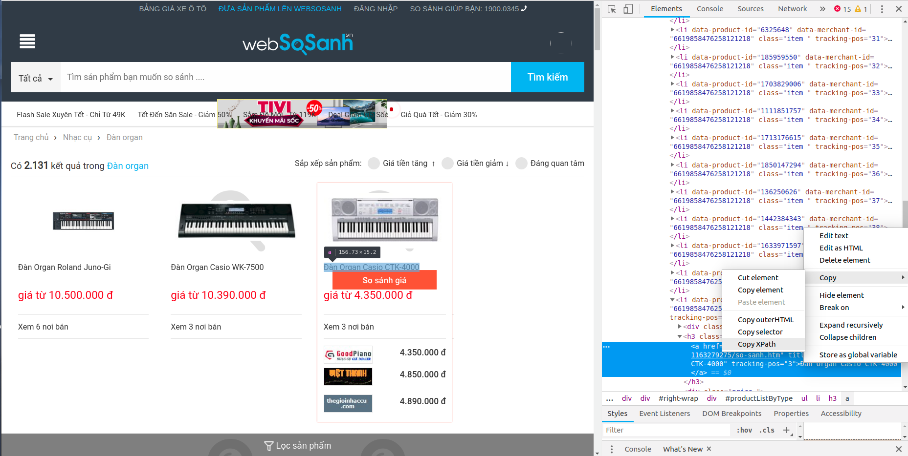
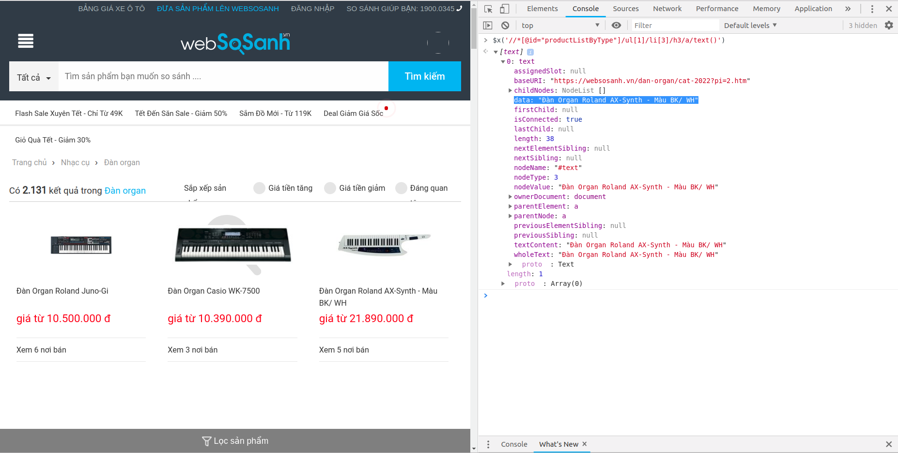
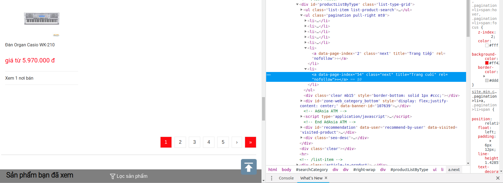
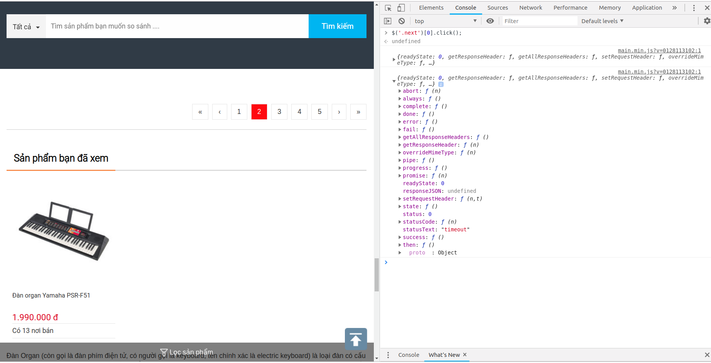
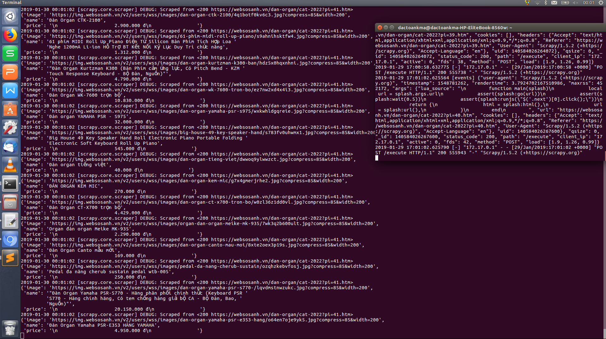
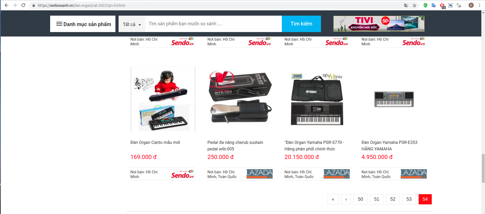

title: Thu thập dữ liệu với Scrapy, Splash, Lua - Nội dung được tạo bởi Javascript 
slug: scrapy
category: Crawl
Date: 2019-01-30

- Thật khó để tìm thấy một trang web hiện đại không sử dụng công nghệ javascript. Khi bạn muốn lấy nội dung được tạo bằng javascript từ một trang web, bạn sẽ nhận ra rằng Scrapy đơn thuần không thể chạy mã javascript trong khi thu thập dữ liệu. Trong bài viết này, mình sẽ  hướng dẫn các bạn cách thu thập dữ liệu từ trang [websosanh](https://websosanh.vn/), websosanh là công cụ tìm kiếm, so sánh giúp người tiêu dùng mua được sản phẩm tốt với giá rẻ nhất tại nơi bán gần nhất.

# Quét nội dung được tạo bởi javascript
## Kiểm tra nội dung nào trên trang web sử dụng javascript
- Khi bạn ghé thăm một trang web để thu thập dữ liệu. Bạn sẽ làm gì? Trước tiên, bạn nên kiểm tra trang web đó trong trình duyệt của bạn với [Quick Javascript Switcher](https://chrome.google.com/webstore/detail/quick-javascript-switcher/geddoclleiomckbhadiaipdggiiccfje) là một tiện ích mở rộng của Chrome cho phép bạn kích hoạt hoặc vô hiệu hóa javaScript của trang web một cách nhanh chóng, nhờ đó bạn có thể dễ dàng kiểm tra xem các nội dung nào của trang web sử dụng javascript. Nếu bạn muốn vượt qua javaScript để tiếp cận dữ liệu bạn muốn, bạn có thể tham khảo 3 giải pháp dưới đây

## Requests-HTML
- Nếu bạn đã từng sử dụng [Requests](http://docs.python-requests.org/en/master/) mô-đun cho python trước đây, gần đây nhà phát triển đã tạo ra một mô-đun mới có tên gọi [Requests-HTML](https://html.python-requests.org/) mà giờ đây cũng có khả năng hiển thị javaScript, giải pháp này chỉ dành cho phiên bản 3.6 của Python (tại thời điểm này). Bạn cũng có thể truy cập [Requests](http://docs.python-requests.org/en/master/) để tìm hiểu thêm về mô-đun này hoặc nếu bạn chỉ quan tâm đến việc hiển thị javaScript thì bạn có thể truy cập [Requests-HTML](https://html.python-requests.org/) để trực tiếp tìm hiểu cách sử dụng mô-đun để  hiển thị javaScript bằng Python.

## Selenium 
- [Selenium](https://selenium-python.readthedocs.io/) là trình duyệt web không có giao diện đồ họa người dùng. Vì vậy, bạn có thể điều khiển trình duyệt thông qua giao diện API hoặc dòng lệnh. Các trình duyệt phổ biến như mozilla và chrome có trình điều khiển web chính thức của riêng họ . Các trình duyệt này có thể tải javaScript để bạn có thể sử dụng chúng trong trình cạo web của mình.

## Splash 
- [Splash](https://splash.readthedocs.io/en/stable/api.html) cung cấp một công cụ để hiển thị mã javaScript cho khung trình thu thập thông tin Scrapy. Nó có các chức năng sau:
```
	Return a good HTML page for the user

	Concurrent rendering multiple pages

	Turn off the picture load, speed up the rendering

	Executing user – defined JS code

	Implementing user defined Lua footsteps is similar to non interface browser phantomjs. 
```

## Đánh giá các giải pháp 
- [Requests-HTML](https://html.python-requests.org/) khá tốt và mới mẻ , tuy nhiên giải pháp này chỉ dành cho phiên bản 3.6 của Python (tại thời điểm này), tài liệu tham khảo tương đối ít.

- Khi bạn chọn giữa hai lựa chọn [Selenium](https://selenium-python.readthedocs.io/) và [Splash](https://splash.readthedocs.io/en/stable/api.html) cho dự án cạo web của mình, bạn nên xem xét một yếu tố: yêu cầu tài nguyên phần cứng. **Selenium** tiêu thụ tài nguyên hệ thống nhiều hơn khi tạo ra hàng ngàn requests trong khi chạy. Mình không khuyến khích bạn sử dụng **Selenium** cho các dự án cạo web. Thay vào đó bạn nên thử  **Splash**. Nó được tạo để chỉ hiển thị nội dung javaScript. Đây chính xác là những gì bạn cần cho việc cạo web. 

# Thực hành
## Mục tiêu
- Thu thập thông tin về **tên**, **giá thành**, **ảnh** của sản phẩm bất kỳ nằm trong **danh mục sản phẩm**. Trong bài viết này, mình sẽ demo việc lấy dữ liệu từ danh mục [đàn organ](https://websosanh.vn/dan-organ/cat-2022.htm)



## Phân tích 
- Trước tiên, mình sử dụng [Quick Javascript Switcher](https://chrome.google.com/webstore/detail/quick-javascript-switcher/geddoclleiomckbhadiaipdggiiccfje) để kiểm tra xem các thành phần nào của trang web có sử dụng javascript bằng cách tắt [Quick Javascript Switcher](https://chrome.google.com/webstore/detail/quick-javascript-switcher/geddoclleiomckbhadiaipdggiiccfje), ngay sau hành động đó các hình ảnh về sản phẩm đồng loạt biến mất như trong hình ảnh bên dưới 



- Như vậy **ảnh sản phẩm** được tạo bởi javascript.

- Một điều cần chú ý tiếp theo là trang web sử dụng phân trang. Phân trang là kỹ thuật phổ biến được các nhà phát triển web sử dụng để hiển thị lượng dữ liệu lớn trong kết quả tìm kiếm hoặc danh sách thay vì đặt tất cả các sản phẩm được liệt kê trên cùng một trang, vì vậy nếu bạn muốn thu thập dữ liệu sản phẩm từ trang web, bạn cần cấu hình tác vụ thu thập dữ liệu của mình với phân trang để có thể lấy được tất cả các sản phẩm được liệt kê trên các trang khác nhau.

- Để ý chút nữa, khi tắt [Quick Javascript Switcher](https://chrome.google.com/webstore/detail/quick-javascript-switcher/geddoclleiomckbhadiaipdggiiccfje) và nhấp vào ô chuyển trang thì trang web không thực thi hành động đó, khi bạn bật lại [Quick Javascript Switcher](https://chrome.google.com/webstore/detail/quick-javascript-switcher/geddoclleiomckbhadiaipdggiiccfje) và lặp lại hành động chuyển trang đồng thời kiểm tra trong tab network/xhr của trình duyệt chrome (Ctrl+Shift+i) thì thấy mã javaScript được thực thi và gửi một loạt yêu cầu **ajax** đến nền trình duyệt chrome 

 

- Theo phân tích này mình đưa ra giải pháp sử dụng scrapy-splash cho việc bóc tách dữ liệu. Khi sử dụng splash, để tương tác với các phần tử javascript(mô phỏng hành vi chuyển trang của người dùng) bạn cần viết tập lệnh [lua](https://splash.readthedocs.io/en/stable/scripting-overview.html).

## Cài đặt splash
- [Splash](https://splash.readthedocs.io/en/stable/) chạy trên [Docker](https://www.digitalocean.com/community/tutorials/how-to-install-and-use-docker-on-ubuntu-16-04) vậy nên đầu tiên bạn phải cài đặt [Docker](https://www.digitalocean.com/community/tutorials/how-to-install-and-use-docker-on-ubuntu-16-04) (hiện mình đang sử dụng Ubuntu 16.04)
- Sau khi có Docker rồi thì bạn chạy lệnh sau:
```
$ sudo docker pull scrapinghub/splash
```
- Bắt đầu với Splash(mở dịch vụ Splash trên cổng 8050 của máy tính cục bộ)
```
$ sudo docker run -p 8050:8050 scrapinghub/splash
```


- Các bạn có thể sử dụng lệnh để thấy cổng 8050 đã mở dịch vụ


## Cài đặt scrapy-splash
- Bạn nên khởi tạo môi trường ảo [virtualenv](https://docs.python.org/3/library/venv.html), cài scrapy và scrapy-splash bằng lệnh:
```
$ pip install scrapy scrapy-splash
```

## Khởi tạo project với scrapy
- Khởi tạo một project với Scrapy bằng lệnh sau:
```
$ scrapy startproject crawl
```


- Sau đó sẽ có một project trông khá đầy đủ như thế này:



- Thêm config trong file settings.py như sau:
```
SPLASH_URL = 'http://127.0.0.1:8050'
DUPEFILTER_CLASS = 'scrapy_splash.SplashAwareDupeFilter'
HTTPCACHE_STORAGE = 'scrapy_splash.SplashAwareFSCacheStorage'
COOKIES_ENABLED = True 
SPLASH_COOKIES_DEBUG = False
SPIDER_MIDDLEWARES = {
    'scrapy_splash.SplashDeduplicateArgsMiddleware': 100,
}
DOWNLOADER_MIDDLEWARES = {
    'scrapy_splash.SplashCookiesMiddleware': 723,
    'scrapy_splash.SplashMiddleware': 725,
'scrapy.downloadermiddlewares.httpcompression.HttpCompressionMiddleware': 810,
'scrapy.downloadermiddlewares.useragent.UserAgentMiddleware': 400,
}
```

## Đặc tả dữ liệu
- File items.py được sử dụng để khai báo những dữ liệu mà mình muốn thu thập. Trong file này có class CrawlItem là class được kế thừa từ class Item của Scrapy. Trong class này đã định nghĩa trước một số đối tượng mà Scrapy cần dùng để  thu thập dữ liệu.
```
import scrapy


class CrawlItem(scrapy.Item):
    # define the fields for your item here like:
    # name = scrapy.Field()
    pass
```

- Bây giờ, mình sẽ thêm vào những dữ liệu cần thu thập gồm tên sản phẩm, giá thành và ảnh sản phẩm.
```
import scrapy


class CrawlItem(scrapy.Item):
    name = scrapy.Field()
    price = scrapy.Field()
    image = scrapy.Field()
```

## Tạo spider
- Tạo một file tên là **websosanh.py** trong thư mục spiders đã được tạo ở trên. Thư mục này là nơi đưa ra các chỉ định cho Scrapy biết chính xác dữ liệu thu thập là gì. Trong thư mục này, bạn có thể định nghĩa các Spider khác nhau cho các trang Web khác nhau.

- Bắt đầu bằng một class kế thừa từ class Spider của Scrapy, mình sẽ thêm vào các thuộc tính cần thiết sau:
```
# -*- coding: utf-8 -*-
import scrapy
from crawl.items import CrawlItem
from scrapy_splash import SplashRequest


class WebsosanhSpider(scrapy.Spider):
    name = "wss"
    allowed_domains = ['websosanh.vn']
    start_urls = ["https://websosanh.vn/dan-organ/cat-2022.htm"]
```

- Trong đó:
```
- name: định nghĩa tên của Spider.
- allowed_domains: chứa URL gốc của trang Web bạn muốn crawl.
- start_urls: là danh sách các URL để Spider bắt đầu quá trình thu thập dữ liệu. Tất cả mọi dữ liệu sẽ được Spider download từ các URL ở trong start_urls này.
```

## Sử dụng xpath selector
```
XPath is a language for selecting nodes in XML documents, which can also be used with HTML.
- Scrapy’s documentation -
```
- Mình sử dụng **xpath** để chọn lọc ra thành phần chính xác cần thu thập dữ liệu dưới sự hỗ trợ của trình duyệt Chrome với Developer Tools, ngoài ra bạn có thể sử dụng **css selector**. Đơn giản thì chỉ cần inspect một đối tượng trên trang web sau đó copy xpath của nó và chỉnh sửa nếu bạn muốn.



- Mình sẽ lấy XPath của phần tử chứa tên sản phẩm ```<h3 class="title">```, kết quả là
```
//*[@id="productListByType"]/ul[1]/li[3]/h3/a/text()
```
Developer Tools của Chrome cũng cho phép test thử xpath trên console của Javascript, bằng cách sử dụng cú pháp $x(), mình sẽ test trong Javascript console:



- Tiếp tục làm như vậy, bạn có thể lấy được xpath của các dữ liệu còn lại, hoặc bạn có thể tự mình chỉnh sửa lại xpath đã có để được kết quả tối ưu hơn.

## Trích xuất dữ liệu
- Bây giờ, mình sẽ chỉnh sửa **websosanh.py** để thêm vào XPath mong muốn.
```
# -*- coding utf-8 -*-
import scrapy
from crawl.items import CrawlItem
from scrapy_splash import SplashRequest


class WebsosanhSpider(scrapy.Spider):

    name = "wss"
    allowed_domains = ['websosanh.vn']
    start_urls = ["https://websosanh.vn/dan-organ/cat-2022.htm"]

    def start_requests(self):
        for url in self.start_urls:
            yield SplashRequest(url, endpoint="render.html", callback=self.parse)

    def parse(self, response):
        item = CrawlItem()
        for data in response.xpath("//li[@class='item ']"):
            item["name"] = data.xpath("./h3/a/text()").extract_first()
            if item["name"] == None:
                item["name"] = data.xpath("./h2/a/text()").extract_first()
            item["price"] = data.xpath("./div[2]/text()").extract_first()
            item["image"] = data.xpath("./div[1]/a/img[1]/@data-src").extract_first()
            yield item
```

- Với đoạn code trên, mình sẽ duyệt qua lần lượt các sản phẩm, và gán các giá trị  **name**, **price**, **image** cho các item từ dữ liệu thu thập được. Như vậy mình mới chỉ lấy được thông tin sản phẩm ở trang đầu tiên, còn các trang còn lại thì làm như thế nào, có không dưới một cách để có thể duyệt qua từng trang để thu thập thông tin sản phẩm như đặt giá trị tăng dần trong vòng lặp URL,...Ở đây mình sẽ sử dụng ngôn ngữ  [lua](https://splash.readthedocs.io/en/stable/scripting-overview.html) để viết một đoạn script nhỏ mô phỏng hành động nhấp chuột chuyển trang của người dùng. Bạn có thể nhấp vào liên kết dẫn tới trang tổng quan về API Splash Lua để tìm hiểu kỹ hơn ngôn ngữ này.

- Để mô phỏng hành động nhấp chuột chuyển trang từ người dùng, đầu tiên mình sẽ tìm đến thành phần chuyển trang 


- Thật dễ dàng để tìm thấy phần tử  ```a.next``` là phần tử chọn duy nhất cho nút tiếp theo của trang này. Khoan đã, nếu không để ý kĩ thì bạn sẽ rất dễ dàng bỏ qua trường hợp này, nút về cuối trang cũng chứa phần tử  ```a.next```



- Dựa theo phân tích đó mình xác định được đoạn mã thực hiện hành động chuyển trang là ```$('.next')[0].click();``` (vì mình muốn chuyển trang lần lượt chứ không phải đi về cuối trang luôn nên mới có ```[0]``` ở đó).

- Để chắc chắc hơn mình sẽ kiểm tra hành động này trong Javascript console 



- Vậy là đoạn mã trên đã đúng, giờ thì tiến hành hoàn thiện code thôi nào, mình muốn đoạn mã trên được lặp lại cho tới khi đi hết trang thì dừng lại, mở  **websosanh.py** và chỉnh sửa nào
```
# -*- coding: utf-8 -*-
import scrapy
from crawl.items import CrawlItem
from scrapy_splash import SplashRequest


class WebsosanhSpider(scrapy.Spider):

    name = "wss"
    allowed_domains = ['websosanh.vn']
    start_urls = ["https://websosanh.vn/dan-organ/cat-2022.htm"]

    def start_requests(self):
        for url in self.start_urls:
            yield SplashRequest(url, endpoint="render.html", callback=self.parse)


    script = """
        function main(splash)
            local url = splash.args.url
            assert(splash:go(url))
            assert(splash:wait(0.5))
            assert(splash:runjs("$('.next')[0].click();"))
            return {
                html = splash:html(),
                url = splash:url(),
            }
        end
        """

    def start_requests(self):
        for url in self.start_urls:
            yield SplashRequest(url, endpoint="render.html", callback=self.parse)

    def parse(self, response):
        item = CrawlItem()
        for data in response.xpath("//li[@class='item ']"):
            item["name"] = data.xpath("./h3/a/text()").extract_first()
            if item["name"] == None:
                item["name"] = data.xpath("./h2/a/text()").extract_first()
            item["price"] = data.xpath("./div[2]/text()").extract_first()
            item["image"] = data.xpath("./div[1]/a/img[1]/@data-src").extract_first()
            yield item

        yield SplashRequest(
            url=response.url,
            callback=self.parse,
            meta={
                "splash": {"endpoint": "execute", "args": {"lua_source": self.script}}
            },
        )
```

- Sau khi xây dựng được công cụ thu thập dữ liệu trên, mình sẽ test khả năng cạo dữ liệu của nó, việc test rất đơn giản, bạn chỉ cần chạy đoạn mã sau ở trong thư mục crawl
```
$ scrapy crawl wss
```

- Hình ảnh bên dưới cho thấy trình thu thập dữ liệu đang chạy cùng với dịch vụ Splash trên cổng 8050 của máy tính mình



- Dữ liệu thu được hoàn toàn trùng khớp với dữ liệu của **websosanh** ở thời điểm mình chạy crawl bao gồm tên sản phẩm, giá thành, link ảnh sản phẩm
```
2019-01-30 00:01:58 [scrapy.core.scraper] DEBUG: Scraped from <200 https://websosanh.vn/dan-organ/cat-2022?pi=54.htm>
{'image': 'https://img.websosanh.vn/v2/users/wss/images/dan-organ-yamaha-psr-e353-hang/o64en7oje9yk5.jpg?compress=85&width=200',
 'name': 'Đàn Organ Yamaha PSR-E353 HÃNG YAMAHA',
 'price': '\n                    4.950.000 đ\n                '}
```

- Nhận thấy trình thu thập đã đi tới trang thứ **54** là trang cuối của danh mục **đàn organ** với sản phẩm cuối cùng có tên **Đàn Organ Yamaha PSR-E353 HÃNG YAMAHA** trùng khớp với thông tin trên **websosanh** 



- Số lượng sản phẩm thu thập được là **2139** sản phẩm


## Kết luận 

- Như vậy mình đã giới thiệu cho các bạn cách để thu thập dữ liệu web được tạo bởi Javascript, hi vọng với bài viết này sẽ giúp ích cho các bạn trong việc crawl dữ liệu và không cảm thấy ngại khi đụng phải những trang web có sử dụng tới Javascript.

- Trong bài viết tiếp theo mình sẽ hướng dẫn các bạn xây dựng một hệ thống thu thập dữ liệu với multiple spiders và khởi chạy tất cả trong một tập lệnh duy nhất. 

- Bạn có thể tham khảo [source của mình trên github](https://github.com/dactoankmapydev/Crawler_Web_Js) nếu thấy cần thiết.

